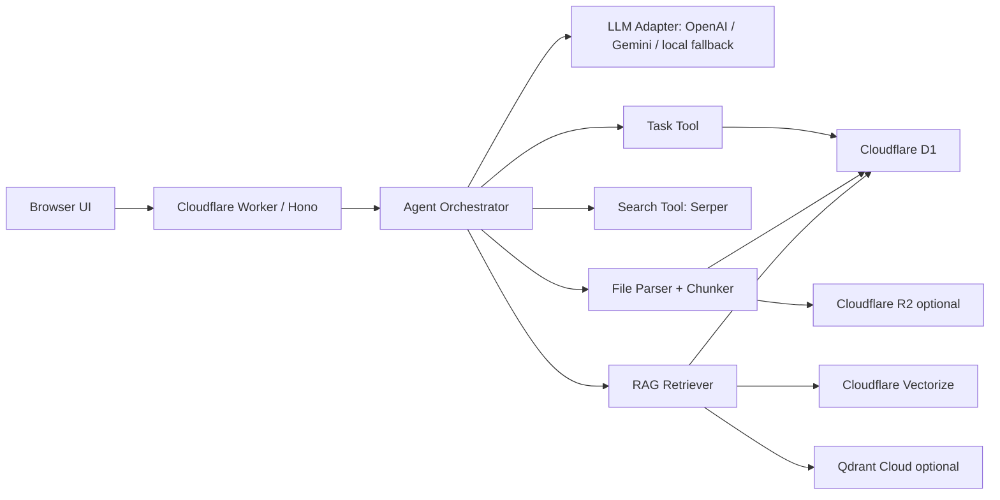

# Mira Task Agent

Mira Task Agent 是一个部署在 Cloudflare Worker 上的智能对话式任务管理助手。它支持流式对话、自然语言任务管理、用户资料和 AI 昵称记忆、实时搜索、深度研究子代理、文件上传解析、分块向量化和 RAG 召回。LLM 层支持 OpenAI、Gemini 和本地 fallback。

## 线上地址

部署后填写：

- Worker URL: `https://task-agent-worker.zeyuwang-task-agent.workers.dev`
- GitHub: `https://github.com/zeyuyuyu/task-agent-worker`

## 功能清单

- 基础对话：网页聊天界面，Worker 端流式输出。
- 用户管理：自动识别姓名、邮箱和 AI 昵称，持久化到 D1。
- 任务管理：用户用自然语言增删改查任务和任务需求，无传统表单。
- 外部搜索：通过 Serper.dev 搜索 API 获取实时信息。
- 深度研究：研究协调代理先拆解搜索子问题，再汇总结构化报告。
- RAG 文件系统：上传 TXT、Markdown、DOCX、PDF 和图片；自动解析、分块、向量化；后续对话语义召回。
- 数据持久化：D1 保存用户、任务、需求、对话、文件和本地向量；Cloudflare Vectorize 保存文档片段与长期记忆向量，Qdrant Cloud 保留为可替换方案。
- 多模态加分：图片上传后可通过 OpenAI 或 Gemini 提取文字和视觉信息并纳入 RAG。

## 架构



代码按边界拆分：

- `src/routes/api.ts`：HTTP API、流式聊天、文件接口。
- `src/agent/tasks.ts`：自然语言任务意图识别和任务工具执行。
- `src/agent/research.ts`：子代理规划、多轮搜索和报告整合。
- `src/services/llm.ts`：LLM 抽象层，当前支持 OpenAI、Gemini 2.0 Flash Lite 和本地降级。
- `src/services/files.ts`：文件解析、分块、embedding、RAG 写入。
- `src/services/qdrant.ts`：向量库适配层。优先使用 Cloudflare Vectorize，其次可切换 Qdrant，最后降级为 D1 本地向量相似度检索。
- `src/ui/app.ts`：无构建步骤的前端工作空间。

## 子代理规划实现

当用户消息命中“深度研究、调研、研究报告、research”等意图时，`runResearch` 会启动研究协调流程：

1. 规划代理把主题拆成 3-5 个可搜索子问题。
2. 搜索代理分别调用 Serper.dev 获取实时结果。
3. 汇总代理基于证据生成中文结构化报告，包含结论摘要、关键发现、不确定性、下一步建议和引用链接。

这个实现刻意保持简单透明，便于后续升级为更复杂的 Tree of Thoughts 或 Graph of Thoughts。

## RAG 与记忆召回流程

1. 用户上传文件到 `/api/files`。
2. 系统按 MIME 类型解析：文本/Markdown 直接读取，DOCX 解包读取 `document.xml`，PDF 使用轻量文本提取，图片使用 OpenAI 或 Gemini 做视觉摘要/OCR。
3. `chunkText` 按约 900 字符分块并保留 overlap。
4. `LlmClient.embed` 生成向量。优先使用 OpenAI `text-embedding-3-small` 的 768 维 embedding；未配置模型 key 时，使用确定性的本地 hash embedding，保证 demo 可运行。
5. 向量和 chunk 原文写入 D1，并同步 upsert 到 Cloudflare Vectorize；若改配 Qdrant，也可同步到 Qdrant。
6. 聊天时对用户问题 embedding，在 Qdrant 或 D1 中召回相关文件片段和长期对话记忆，注入系统提示词。

## 数据库

D1 schema 位于 `migrations/0001_initial.sql`，核心表：

- `users`
- `conversations`
- `tasks`
- `task_requirements`
- `files`
- `chunks`
- `memories`

## 本地开发

```bash
npm install
npm run db:migrate:local
npm run dev
```

打开 `http://localhost:8787`。

## Cloudflare 部署

1. 登录 Cloudflare：

```bash
npx wrangler login
npx wrangler whoami
```

2. 创建 D1：

```bash
npx wrangler d1 create task_agent_db
```

把输出里的 `database_id` 写入 `wrangler.toml`。

3. 创建 Vectorize 索引：

```bash
npx wrangler vectorize create task-agent-chunks --dimensions=768 --metric=cosine
```

4. 执行远端迁移：

```bash
npm run db:migrate:remote
```

5. 配置 secrets。OpenAI 和 Gemini 二选一即可，OpenAI 会优先生效：

```bash
npx wrangler secret put OPENAI_API_KEY
```

或：

```bash
npx wrangler secret put GEMINI_API_KEY
```

搜索功能另配：

```bash
npx wrangler secret put SERPER_API_KEY
```

可选 Qdrant：

```bash
npx wrangler secret put QDRANT_URL
npx wrangler secret put QDRANT_API_KEY
```

6. 部署：

```bash
npm run deploy
```

## 环境变量

- `OPENAI_API_KEY`：OpenAI API key。配置后优先使用 OpenAI。
- `OPENAI_MODEL`：默认 `gpt-4o-mini`。
- `OPENAI_EMBEDDING_MODEL`：默认 `text-embedding-3-small`，请求 768 维 embedding 以兼容当前向量库。
- `GEMINI_API_KEY`：Gemini API key，未配置 OpenAI 时使用。
- `GEMINI_MODEL`：默认 `gemini-2.0-flash-lite`。
- `SERPER_API_KEY`：Serper.dev key。
- `VECTORIZE`：Cloudflare Vectorize 绑定，当前索引名 `task-agent-chunks`。
- `QDRANT_URL` / `QDRANT_API_KEY`：可选向量数据库替代方案。
- `QDRANT_COLLECTION`：默认 `task_agent_chunks`。

## 已知挑战与处理

- Worker 不适合运行重型 PDF/OCR 依赖，所以 PDF 采用轻量 best-effort 解析，图片交给多模态模型。
- 为保证没有外部 key 时也能演示，LLM 和 embedding 都提供本地降级路径。
- Cloudflare Vectorize 已作为线上向量数据库使用；Qdrant 是可选替代，未配置向量库时仍可使用 D1 中保存的向量做余弦相似度检索，降低部署门槛。
